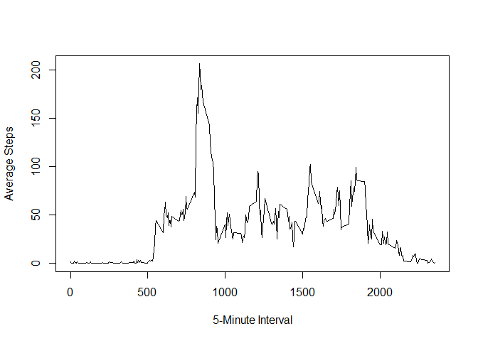

# Reproducible Research: Peer Assessment 1

## Loading and preprocessing the data
- Load the data which was saved in the working directory (missing data coded as "NA").
- convert the date variable from Factor to Date format.


```r
library(plyr)
```

```
## Warning: package 'plyr' was built under R version 3.1.2
```

```r
y <- read.table(unzip("activity.zip", "activity.csv"), sep = ",", header=T, na.strings = "NA")
y$date <- as.Date(y$date, "%Y-%m-%d")
```
## What is mean total number of steps taken per day?
- Make a histogram of total number of steps per day. 

```r
#Need to sum the steps per day across intervals. 
t <- aggregate(steps ~ date, data = y, FUN = sum)
hist(t$steps, main = "Frequency of Steps per Day", xlab = "Steps", breaks = 6)
```

 
- Calculate the mean and median total number of steps taken per day  


```r
mean(t$steps)
```

```
## [1] 10766.19
```

```r
median(t$steps)
```

```
## [1] 10765
```
## What is the average daily activity pattern?
- Aggregate across the 5 minute intervals. 
- Time series plot across 5-minute intervals

```r
i <- aggregate(steps ~ interval, data = y, mean)
plot(i, type = "l", ylab = "Average Steps", xlab = "5-Minute Interval")
```

 
 - Which interval contains the maximum average number of steps?


```r
s2 <- which(i$steps == max(i$steps))  #produces the row #
i$interval[s2]
```

```
## [1] 835
```

## Imputing missing values
- Total number of missing rows in the dataset (total number of rows with NAs)

```r
sum(is.na(y$steps)) 
```

```
## [1] 2304
```
- Impute missing values in a new dataset. Input with mean for the interval. 

```r
#y2 is the new dataset with missing values filled in
y2 <- y
for(v in 1:nrow(y)){
  if (is.na(y[v, 1])) {
    y2[v, 1] <- i[which(i$interval == y[v, 3]), 2]
} else {y2[v, ] <- y[v, ]}
}
```
- Histogram of total steps taken per day, report mean median. 

```r
t2 <- aggregate(steps ~ date, data = y2, FUN = sum)
hist(t2$steps, main = "Frequency of Steps per Day", xlab = "Steps", breaks = 6)
```

 

```r
mean(t2$steps)
```

```
## [1] 10766.19
```

```r
median(t2$steps)
```

```
## [1] 10766.19
```
- As reported, the mean is the exact same between the first dataset, and the 
 dataset with imputed values for missing, and the median is different by less than
 one step. 
 
 - the impact of imputing missing values for the total number of daily steps is null because i am only inserting the average across the other intervals.   

## Are there differences in activity patterns between weekdays and weekends?

```r
y2$Weekday1 <- weekdays(y2$date, abbreviate = TRUE)
for (v in 1:nrow(y2)){
 if (y2[v, 4] == "Sat" | y2[v, 4] == "Sun") {
  y2[v, 4] <- 0
} else { y2[v, 4] <- 1}
}
y2$Weekday1 <- as.numeric(y2$Weekday1)
```
- two panel plot showing average number of steps for weekdays versus weekends

```r
library(lattice)
a2 <- subset(y2, Weekday1 == 1)   #weekdays
a3 <- subset(y2, Weekday1 == 0)   #weekends
b2 <- aggregate(steps ~ interval, data = a2, mean)
b3 <- aggregate(steps ~ interval, data = a3, mean)
#Need two panel plot for interval and steps for b2 and b3
par(mfrow = c(2, 1), mar = c(4, 4, 2, 1))
plot(b2$interval, b2$steps, type = "l", ylab = "Steps", xlab = "Interval")
title("Weekdays", line= 0)
plot(b3$interval, b3$steps, type = "l",ylab = "Steps", xlab = "Interval", ylim = c(0, 200))
title("Weekends", line = 0)
```

 
